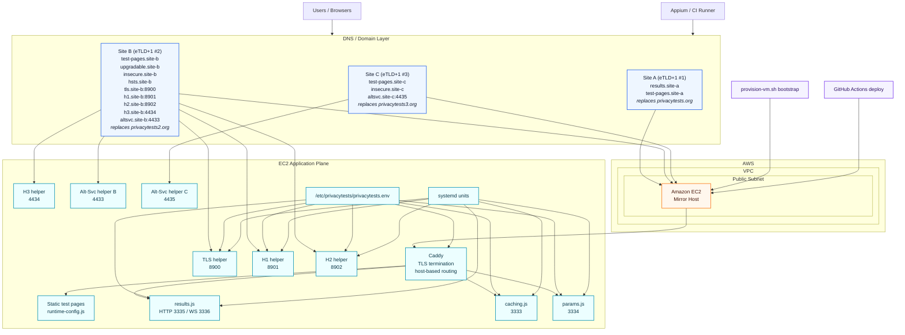

# Mirror Architecture Overview

This is a high-level deployment view for a PrivacyTests mirror running on a
single EC2 instance.

The key structural requirement is that the mirror must preserve three distinct
registrable domains (three eTLD+1s), because the upstream test suite models:

- site A: `privacytests.org`
- site B: `privacytests2.org`
- site C: `privacytests3.org`

The mirror replaces those with three equivalent domain groups while keeping the
application stack on one VM.

## High-Level Diagram

## Reading The Diagram

- All public hostnames terminate on one EC2 instance.
- Caddy is the public ingress layer for the browser-facing hosts on `80/443`.
- The main Node services stay internal to the host on `3333-3336`.
- Specialized helper listeners stay on their dedicated ports for the connection
  and protocol tests.
- Provisioning and deploy are separate concerns:
  - `provision-vm.sh` bootstraps a fresh instance
  - GitHub Actions performs routine sync/restart/health-check deploys

## Domain Model

The three-domain split is part of the test design, not just an implementation
detail.

- Site A is the results and alternate first-party domain.
- Site B is the primary active test domain plus most helper hosts.
- Site C is the third-site domain used for cross-session and selected helper
  behaviors.

If site B and site C are only subdomains under the same registrable domain,
the mirror is not equivalent to upstream for all tests.
